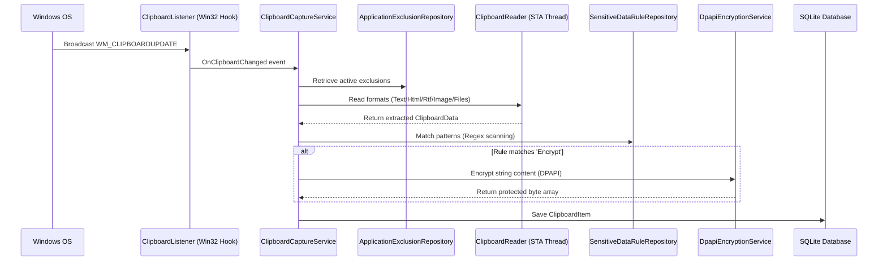

# Architecture Documentation - Enterprise Clipboard Manager

This document describes the logical layers, system dependencies, and execution flows.

## Layer Overview

The project is structured according to Clean Architecture guidelines:

1. **EnterpriseClipboard.Domain**: Defines the fundamental domain entities (`ClipboardItem`, `ClipboardGroup`, `ClipboardTag`, etc.) and basic domain enumeration rules. Completely dependency-free.
2. **EnterpriseClipboard.Application**: Declares use cases and abstracts platform-specific features using interfaces (e.g. `IClipboardRepository`, `IEncryptionService`, `IPasteService`).
3. **EnterpriseClipboard.Persistence**: Implements database interactions with SQLite using Entity Framework Core. Automatically configures SQLite pragmas (WAL mode, busy timeout) and database indexes.
4. **EnterpriseClipboard.Infrastructure**: Implements cryptography (DPAPI) and files/settings operations.
5. **EnterpriseClipboard.WindowsIntegration**: Uses P/Invoke to register global hotkeys, capture foreground active process details, simulate `Ctrl+V` key events, and hook the Windows clipboard change listener.
6. **EnterpriseClipboard.App**: WPF Presentation Layer. Implements MVVM pattern, controls styling (ModernDarkTheme), dependency injection composition root, and tray menu orchestration.

---

## Clipboard Capture Flow

